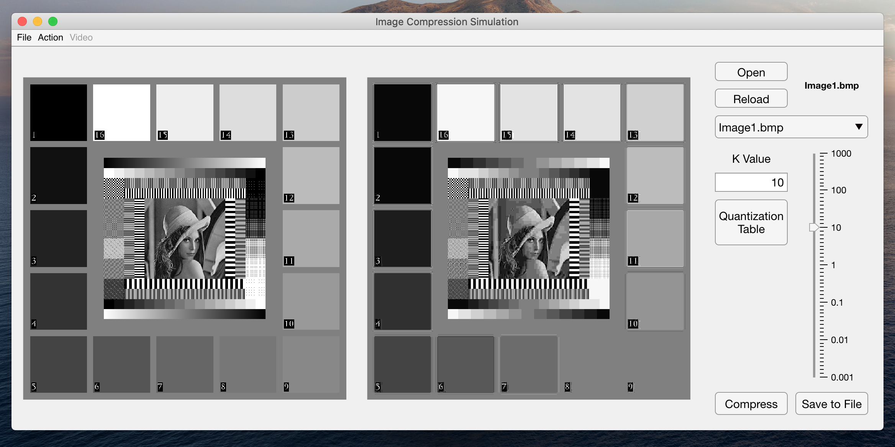
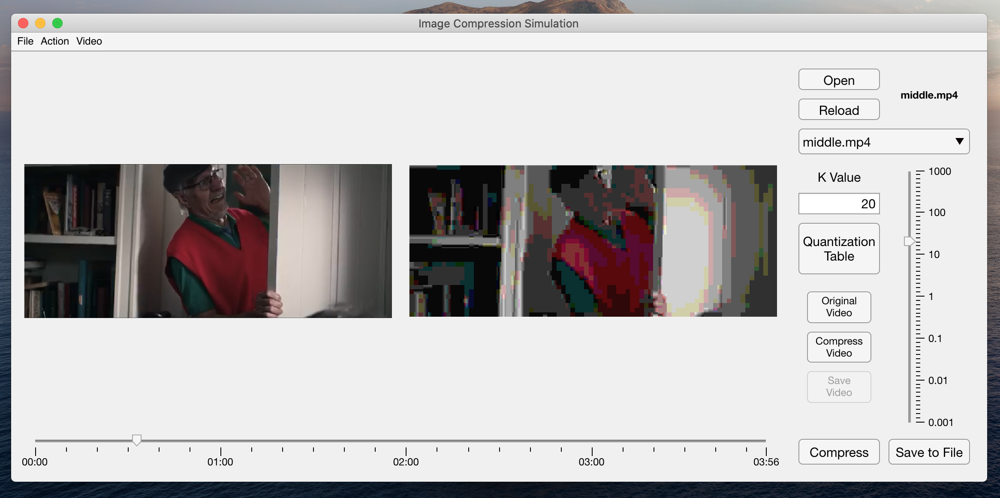
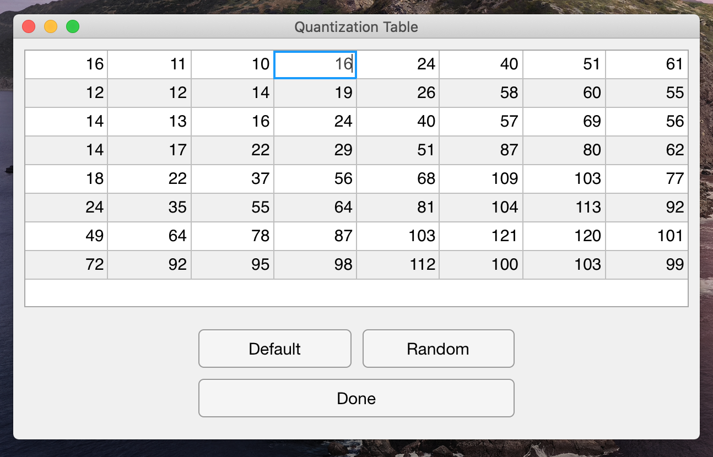

# Image Compression Simulation 

2019 COP501 Advanced Programming Coursework

Loughborough University

## Introduction

Image compression is to decrease the size of the image file without dramatically downgarding the quality of the image.

In this courework, I set out to implement a simulation of the JPEG (Joint Photographic Experts Group) image compression process. The implementation uses MATLAB as frontend interface and Python as backend.

## Features

- JPEG Image Compression Simulation

- JPEG "Video Compression" Simulation

- Changing K Value or Quantization Table

## Usage

Open `CompressApp.mlapp` with App Designer in MATLAB.

**Requirements:** MATLAB > 2019b, Python 3.5+

© Zhihao DAI 2019